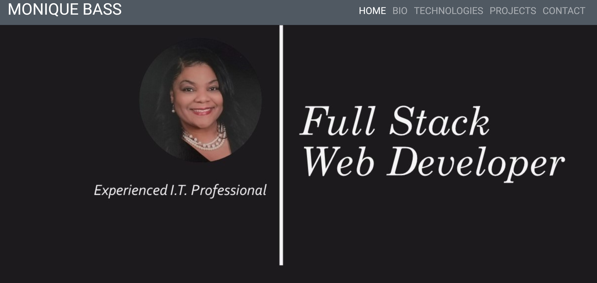

# Personal Bio Site

## Description
This project showcases the projects created during the FrontEnd Web Development course.
### Feature List
- Bio About Me Section
- Technologies Learned
- Projects Created
- Contact

### Project List
- Pinterest
- Chatty Cobrially
- Star Destroyer
- Mushroom-Picker
 

## Screenshots
### Home

### Bio

### Technologies

### Projects

### Contact

 ## How to Run
1. Clone down this repo
1. Make sure you have http-server installed via npm. If not get it [HERE](https://www.npmjs.com/package/http-server).
1. On your command line run `hs -p 9999`
1. In your browser go to `http://localhost:9999`

## Contributors
[Monique Bass](https://github.com/Nikababy01)

